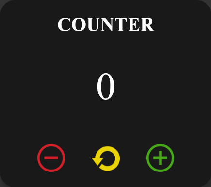

<div id="top"></div>
<br/>
<!-- PROJECT LOGO -->
<br />
<div align="center">
  <a href="https://github.com/riky97/Progetto-JavaScript-Basics-di-Riccardo-Ingrasciotta">
    
  </a>

<h3 align="center">COUNTER_APP</h3>

  <p align="center">
    project_description
    <br />
    <a href="https://github.com/github_username/repo_name"><strong>Explore the docs »</strong></a>
    <br />
    <br />
    <a href="https://github.com/github_username/repo_name">View Demo</a>
    ·
    <a href="https://github.com/github_username/repo_name/issues">Report Bug</a>
    ·
    <a href="https://github.com/github_username/repo_name/issues">Request Feature</a>
  </p>
</div>
<br/>
<!-- TABLE OF CONTENTS -->

<details>
  <summary>Table of Contents</summary>
  <ol>
    <li>
      <a href="#about-the-project">About The Project</a>
      <ul>
        <li><a href="#built-with">Built With</a></li>
      </ul>
    </li>
    <li>
      <a href="#getting-started">Getting Started</a>
      <ul>
        <li><a href="#installation">Installation</a></li>
      </ul>
    </li>
    <li><a href="#usage">Usage</a></li>
    <li><a href="#roadmap">Roadmap</a></li>
    <li><a href="#contributing">Contributing</a></li>
    <li><a href="#license">License</a></li>
    <li><a href="#contact">Contact</a></li>
    <li><a href="#acknowledgments">Acknowledgments</a></li>
  </ol>
</details>
<!-- ABOUT THE PROJECT -->

## About The Project

[![Product Name Screen Shot][product-screenshot]](https://mywebcounterapp.netlify.app/)

### Built With

- [HTML](https://www.w3schools.com/html/html_intro.asp)
- [CSS](https://www.w3schools.com/css/css_intro.asp)
- [Javascript](https://www.javascript.com/)
- [Bootstrap](https://getbootstrap.com)

<p align="right"><a href="#top"></a></p>

<!-- GETTING STARTED -->

## Getting Started

To install the project locally, copy and paste the following command on the command prompt.
A local copy will be created that you can modify as you wish.

### Installation

1. Clone the repo
   ```sh
   git clone https://github.com/riky97/Progetto-JavaScript-Basics-di-Riccardo-Ingrasciotta.git
   ```

<p align="right"><a href="#top"></a></p>

## Usage

The project is based on a counter application.
You can modify the value of the counter using the + and - buttons.
You can restart the counter value using the restart button.
To try the application:
_follow this link [Test](https://mywebcounterapp.netlify.app/)_

<p align="right"><a href="#top"></a></p>

<!-- MARKDOWN LINKS & IMAGES -->

[product-screenshot]: img/img_readme.png
